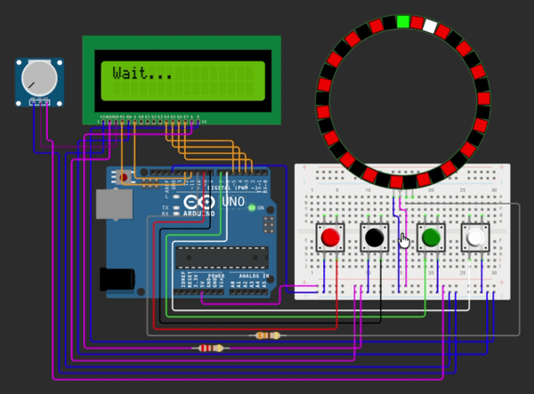

# Arduino Roulette (WOKWI)

Simulation of a simplified roulette game running on Arduino.

## Components

- Arduino Uno
- Half Breadboard
- NeoPixel Compatible LED Ring (WS2812)
- LCD 16x2
- Pushbutton (4)
- Resistor 220Ω
- Resistor 330Ω
- Potentiometer

## Features

- Ball spinning animation on the NeoPixel ring
- Random roulette result
- Simple colour betting system (Red, Black, Green)
- Rules and result displayed on the LCD

## Controls

- Red button: bet on red
- Black button: bet on black
- Green button: bet on green
- White button: Spin the roulette wheel

## Test

Test the project on Wokwi:
https://wokwi.com/projects/457921993870979073
